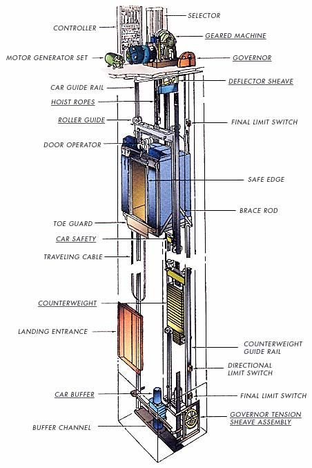
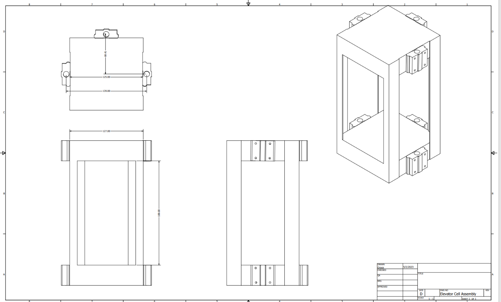
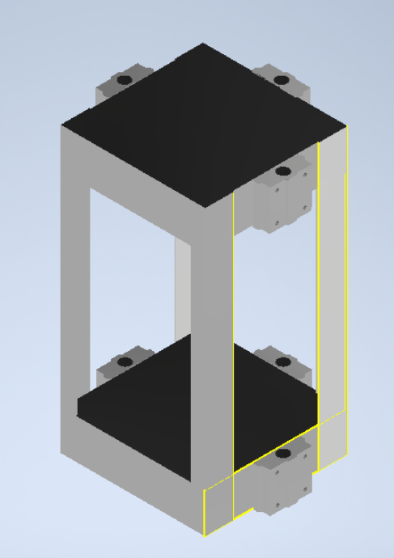
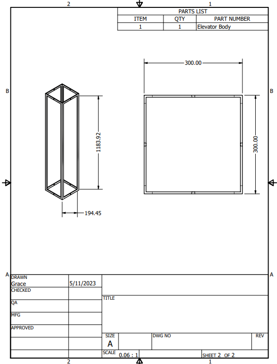
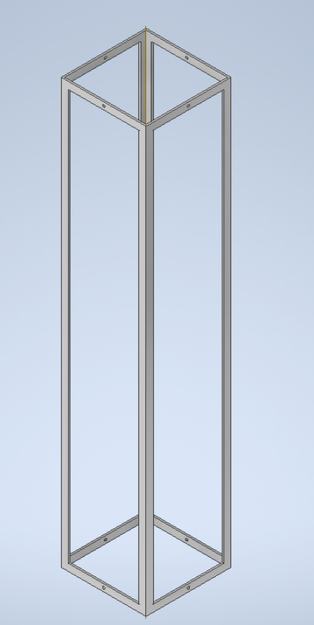
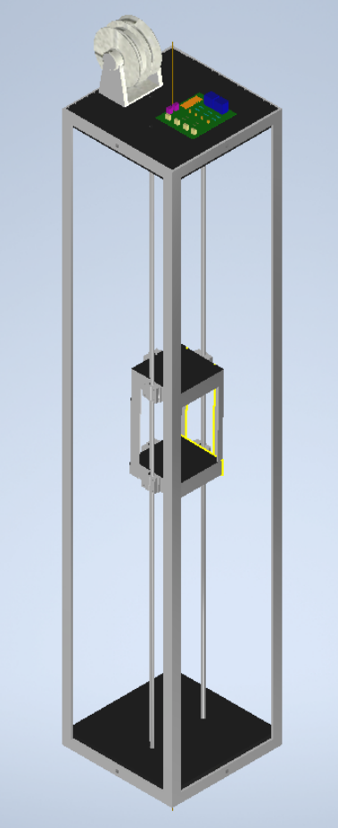
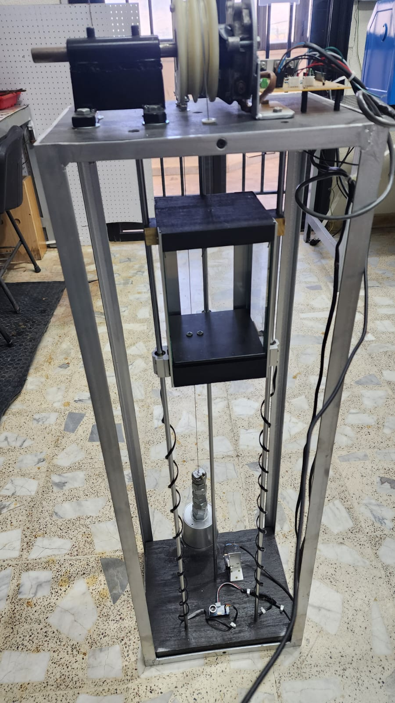

# Elevator-Control-System
## Abstract
This abstract presents an elevator control system utilizing a cascaded Proportional-Integral-Derivative (PID) controller to manage the position and velocity of a DC motor. The system ensures precise and smooth elevator movement, enhancing user comfort and safety.
The position PID controller determines the elevator car's accurate positioning by comparing the desired and actual positions, minimizing steady-state errors and abrupt changes. The velocity PID controller regulates motor speed by maintaining the desired velocity while damping oscillations and reducing overshoot. Together, these controllers enable smooth and efficient motion.
By implementing cascaded PID control, the system achieves reliable performance, accurate floor positioning, and a comfortable ride with minimal errors and reduced jerky movements.

## Objectives
1. To explain the concept of a PID controller.
2. Design an Elevator using Autodesk Inventor.
3. Design, test and implement a cascaded PID controller for an elevator system to control its position and velocity.

## Background Theory
Elevators, also known as lifts, are vertical transportation systems designed to transport people or goods between different floors or levels of a building. Elevators play a crucial role in modern architecture and have become an integral part of high-rise buildings, commercial complexes, residential towers, and other structures. The operation and control of elevators involve various engineering principles and technologies to ensure safe, efficient, and reliable transportation.
### Basic Elevator Components:
An elevator system consists of several key components:
1. Cab/Car: The elevator car is the enclosed platform that carries passengers or goods. It moves vertically along guide rails, providing transportation between different floors.
2. Hoistway/Shaft: The hoistway, also called the elevator shaft, is the vertical space in which the elevator car travels. It is constructed with sturdy walls and contains the guide rails, counterweights, and other essential components.
3. Counterweights: Counterweights are designed to offset the weight of the elevator car and its occupants. They help reduce the overall energy required for vertical movement and enhance the system's efficiency.
4. Traction System or Hydraulic System: Elevators typically employ either a traction system or a hydraulic system for vertical motion. The traction system uses ropes or belts connected to an electric motor, whereas the hydraulic system relies on hydraulic fluid and a piston arrangement to move the elevator car.
5. Control System: The control system manages the operation of the elevator, including starting, stopping, and speed regulation. It monitors various sensors, processes user inputs, and ensures the safety and smooth functioning of the elevator.
      

### Elevator Control System:
Elevator control systems are responsible for regulating the movement of the elevator car, ensuring precise positioning, smooth acceleration and deceleration, and efficient operation. Various control strategies can be implemented, including:
1. Simple Relay Control: This basic control system uses electromechanical relays to manage the elevator's operation. It involves limit switches to detect floor positions, relays for starting and stopping the motor, and basic logic circuits for floor selection.
2. Microprocessor-based Control: Modern elevator control systems often utilize microprocessors or programmable logic controllers (PLCs) for advanced functionality and flexibility. These systems can incorporate more sophisticated algorithms, monitoring sensors, and safety features.

### PID Control in Elevator Systems:
Proportional-Integral-Derivative (PID) control is a popular control technique widely employed in elevator systems. The PID controller continuously calculates an error signal, which represents the difference between the desired position or speed and the actual position or speed of the elevator. The controller then adjusts the control inputs, such as motor voltage or hydraulic pressure, based on the proportional, integral, and derivative terms to minimize the error and achieve the desired performance.
The position PID controller focuses on accurately controlling the elevator's stopping position at each floor, while the velocity PID controller regulates the speed and acceleration/deceleration profiles to ensure smooth and comfortable motion between floors.
Benefits of PID Control in Elevators:
PID control offers several advantages in elevator systems:
1. Precise Positioning: PID control helps achieve accurate and repeatable floor positioning, minimizing deviations and providing a comfortable boarding and disembarking experience for passengers.
2. Smooth Motion: By regulating velocity and acceleration profiles, PID control ensures smooth and jerk-free elevator movement, reducing passenger discomfort and potential accidents.
3. Robust Performance: PID control can adapt to varying loads, changing passenger capacities, and external disturbances, maintaining stable and reliable operation under different conditions.
4. Easy Tuning: PID control parameters can be adjusted and tuned to optimize elevator performance based on specific requirements, allowing for customization and fine-tuning as needed.

## Required Components
1. Arduino Nano.
2. Ultrasonic Sensor.
3. Photoelectric encoder HC-020K.
4. Resistors: 1KΩ x6.
5. TIP120 x4.
6. BC547B x4.
7. 1N914B x4.
8. Limit Switch x2.
9. Terminal Block I4 .
10. Terminal Block I2 x2.
11. DC Motor.

## Mechanical Design
The elevator was constructed using Inventor software, in which we created an outer elevator structure resembling a cell shape. Additionally, we incorporated a sliding cell that moves along three rods, utilizing linear bearings for its smooth motion. In our elevator design, we implemented a double-sided pulley mechanism to facilitate the upward and downward movement. This pulley system is connected to a DC motor of our choice. Furthermore, we incorporated a counterweight system that works in tandem with the pulley, ensuring balanced and efficient operation of the elevator.
- This Figure represents the Elevator Cell Schematic

- This Figure represnts The Elevator cell Assembly

- This Figure represents the Elevator's Body

- This Figure shows the Elevator's Body in 3D

- This Figure Shows the Elevator's Full Assembly:

- This Figure shows the Elevator's Implementation:

