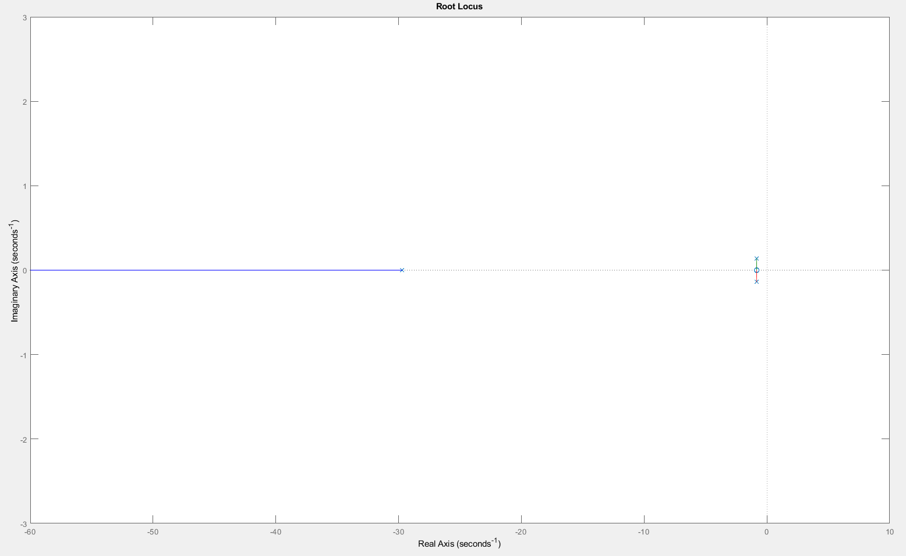

# Elevator-Control-System
## Abstract
This abstract presents an elevator control system utilizing a cascaded Proportional-Integral-Derivative (PID) controller to manage the position and velocity of a DC motor. The system ensures precise and smooth elevator movement, enhancing user comfort and safety.
The position PID controller determines the elevator car's accurate positioning by comparing the desired and actual positions, minimizing steady-state errors and abrupt changes. The velocity PID controller regulates motor speed by maintaining the desired velocity while damping oscillations and reducing overshoot. Together, these controllers enable smooth and efficient motion.
By implementing cascaded PID control, the system achieves reliable performance, accurate floor positioning, and a comfortable ride with minimal errors and reduced jerky movements.

## Objectives
1. To explain the concept of a PID controller.
2. Design an Elevator using Autodesk Inventor.
3. Design, test and implement a cascaded PID controller for an elevator system to control its position and velocity.

## Background Theory
Elevators, also known as lifts, are vertical transportation systems designed to transport people or goods between different floors or levels of a building. Elevators play a crucial role in modern architecture and have become an integral part of high-rise buildings, commercial complexes, residential towers, and other structures. The operation and control of elevators involve various engineering principles and technologies to ensure safe, efficient, and reliable transportation.
### Basic Elevator Components:
An elevator system consists of several key components:
1. Cab/Car: The elevator car is the enclosed platform that carries passengers or goods. It moves vertically along guide rails, providing transportation between different floors.
2. Hoistway/Shaft: The hoistway, also called the elevator shaft, is the vertical space in which the elevator car travels. It is constructed with sturdy walls and contains the guide rails, counterweights, and other essential components.
3. Counterweights: Counterweights are designed to offset the weight of the elevator car and its occupants. They help reduce the overall energy required for vertical movement and enhance the system's efficiency.
4. Traction System or Hydraulic System: Elevators typically employ either a traction system or a hydraulic system for vertical motion. The traction system uses ropes or belts connected to an electric motor, whereas the hydraulic system relies on hydraulic fluid and a piston arrangement to move the elevator car.
5. Control System: The control system manages the operation of the elevator, including starting, stopping, and speed regulation. It monitors various sensors, processes user inputs, and ensures the safety and smooth functioning of the elevator.
      


### Elevator Control System:
Elevator control systems are responsible for regulating the movement of the elevator car, ensuring precise positioning, smooth acceleration and deceleration, and efficient operation. Various control strategies can be implemented, including:
1. Simple Relay Control: This basic control system uses electromechanical relays to manage the elevator's operation. It involves limit switches to detect floor positions, relays for starting and stopping the motor, and basic logic circuits for floor selection.
2. Microprocessor-based Control: Modern elevator control systems often utilize microprocessors or programmable logic controllers (PLCs) for advanced functionality and flexibility. These systems can incorporate more sophisticated algorithms, monitoring sensors, and safety features.

### PID Control in Elevator Systems:
Proportional-Integral-Derivative (PID) control is a popular control technique widely employed in elevator systems. The PID controller continuously calculates an error signal, which represents the difference between the desired position or speed and the actual position or speed of the elevator. The controller then adjusts the control inputs, such as motor voltage or hydraulic pressure, based on the proportional, integral, and derivative terms to minimize the error and achieve the desired performance.
The position PID controller focuses on accurately controlling the elevator's stopping position at each floor, while the velocity PID controller regulates the speed and acceleration/deceleration profiles to ensure smooth and comfortable motion between floors.
Benefits of PID Control in Elevators:
PID control offers several advantages in elevator systems:
1. Precise Positioning: PID control helps achieve accurate and repeatable floor positioning, minimizing deviations and providing a comfortable boarding and disembarking experience for passengers.
2. Smooth Motion: By regulating velocity and acceleration profiles, PID control ensures smooth and jerk-free elevator movement, reducing passenger discomfort and potential accidents.
3. Robust Performance: PID control can adapt to varying loads, changing passenger capacities, and external disturbances, maintaining stable and reliable operation under different conditions.
4. Easy Tuning: PID control parameters can be adjusted and tuned to optimize elevator performance based on specific requirements, allowing for customization and fine-tuning as needed.

## Required Components
1. Arduino Nano.
2. Ultrasonic Sensor.
3. Photoelectric encoder HC-020K.
4. Resistors: 1KΩ x6.
5. TIP120 x4.
6. BC547B x4.
7. 1N914B x4.
8. Limit Switch x2.
9. Terminal Block I4 .
10. Terminal Block I2 x2.
11. DC Motor.

## Mechanical Design
The elevator was constructed using Inventor software, in which we created an outer elevator structure resembling a cell shape. Additionally, we incorporated a sliding cell that moves along three rods, utilizing linear bearings for its smooth motion. In our elevator design, we implemented a double-sided pulley mechanism to facilitate the upward and downward movement. This pulley system is connected to a DC motor of our choice. Furthermore, we incorporated a counterweight system that works in tandem with the pulley, ensuring balanced and efficient operation of the elevator.
- This Figure represents the Elevator Cell Schematic


- This Figure represnts The Elevator cell Assembly


- This Figure represents the Elevator's Body


- This Figure shows the Elevator's Body in 3D


- This Figure Shows the Elevator's Full Assembly:


- This Figure shows the Elevator's Implementation:


## Electrical Desing
Using Easy EDA, we developed an H-Bridge configuration specifically designed to control the DC motor in both clockwise (cw) and counterclockwise (ccw) directions.


- The following Figures shows the PCB Design:


## Control Design
### Position PID Tuning
The DC Motor Transfer function found using MATLAB’s System identification toolbox is the following: 

θm(s)/Ea(s) = 72.59 / s(s+1.667)

- The following Figure shows the Open Loop Step Response:


After Tuning the PID Controller:

- Step Response for the Closed Loop:


- Root Locus:



- Bode Plot:


The Tuned Parameters for the Position PID Controller are the following:
- Kp = 0.68181
- Ki = 0.28391
- Kd = 0.40933
- Rise Time = 0.25 secs
- Settling Time = 0.25 secs
- Overshoot = 0.29%
- Peak = 1.01
- Gain margin = -inf dB @ 0 rad/s
- Phase margin = 90 deg @ 29.7 rad/s

### Velocity PID Tuning
To control the Elevator’s velocity the following transfer function is presented:

sθm(s)/Ea(s) = 72.59s/s(s+1.667) = 72.59 / s+1.667

Since V(t) = dr(t)/dt in the time domain, so the velocity in the frequency domain will become V(s)=sR(s) where R represents the position vector of the elevator cell.

- Step Response for the cascaded Open loop System:


After Tuning the Controller for the System:

- Step Response:


- Bode Plot


- Root Locus


The tuned Parameters for the cascaded PID controller are the following:
- Kp = 14.9465
- Ki = 6.176
- Kd = 9.0429
- Rise Time = 1.48 secs
- Settling Time = 6.65 Secs
- Overshoot = 3.28%
- Peak = 1.03
- Gain Margin = -Inf dB @ 0 rad/s
- Phase Margin = 90 deg @ 8.97 rad/s

## MATLAB Code
- Define the transfer function for the plant

```matlab
num = [1];  % Numerator coefficients
den = [1, 1.667, 0];  % Denominator coefficients
Gsys = tf(num, den);  % Create the transfer function object
```

- Define PID gains for cascaded loop
```matlab
% Inner loop PID (C1) - Using outer loop gains
Kp1 = 14.9465;  % Proportional gain for PID1 (outer loop parameters)
Ki1 = 6.176;    % Integral gain for PID1 (outer loop parameters)
Kd1 = 9.0429;   % Derivative gain for PID1 (outer loop parameters)
C1 = pid(Kp1, Ki1, Kd1);

% Outer loop PID (C2) - Position control (replacing inner loop gains)
Kp2 = 14.9465;  % Proportional gain for PID2 (same as C1)
Ki2 = 6.176;    % Integral gain for PID2 (same as C1)
Kd2 = 9.0429;   % Derivative gain for PID2 (same as C1)
C2 = pid(Kp2, Ki2, Kd2);
```

- Cascaded control:
```matlab
% The inner loop (using outer loop parameters) is closed first with Gsys and C1
inner_loop = feedback(Gsys * C1, 1);

% The outer loop uses the closed inner loop as its plant
sys = feedback(inner_loop * C2, 1);
```

- Step Response

```matlab
t_step = 0:0.01:10;  % Define time vector for step response
[y_step, t_step] = step(sys, t_step);
figure;
plot(t_step, y_step);
title('Step Response (Cascaded PID Control)');
xlabel('Time (s)');
ylabel('Amplitude');
grid on;
```

- Impulse Response
```matlab
[y_impulse, t_impulse] = impulse(sys);
figure;
plot(t_impulse, y_impulse);
title('Impulse Response (Cascaded PID Control)');
xlabel('Time (s)');
ylabel('Amplitude');
grid on;
```

- Compute performance metrics for step response
```matlab
rise_time_index = find(y_step >= 0.9, 1);  % Approximate rise time threshold
settling_time_index = find(abs(y_step - 1) < 0.02, 1, 'last');
rise_time = t_step(rise_time_index);
settling_time = t_step(settling_time_index);
percent_overshoot = (max(y_step) - 1) * 100;

fprintf('Rise Time (Step Response): %.2f seconds\n', rise_time);
fprintf('Settling Time (Step Response): %.2f seconds\n', settling_time);
fprintf('Percent Overshoot (Step Response): %.2f%%\n', percent_overshoot);
```

- Root Locus
```matlab
figure;
rlocus(sys);
title('Root Locus (Cascaded PID Control)');
```

- Bode Plot
```matlab
figure;
bode(sys);
title('Bode Plot (Cascaded PID Control)');
```

## Arduino Code

- Include Libraries and define params:

```c
#include <PID_v2.h>

// Define motor pins
const int motorPinFWD = 6;  // Forward motor pin
const int motorPinBWD = 7;  // Backward motor pin
const int trigPin = 4;      // Trigger pin for ultrasonic sensor
const int echoPin = 5;      // Echo pin for ultrasonic sensor
const int encoderPin = 7;   // Encoder pin for speed measurement
const int LimitTop = 2;     // Top limit switch
const int LimitBottom = 3;  // Bottom limit switch

unsigned int pulses_per_turn = 20;
double rotation;
int count = 0;
long duration;
long distance;

// Define position PID constants
double Kp_position = 0.68181;
double Ki_position = 0.28391;
double Kd_position = 0.40933;

// Define speed PID constants
double Kp_speed = 14.9465;
double Ki_speed = 6.176;
double Kd_speed = 9.0429;

// Define position and speed setpoints and inputs
double positionSetpoint = 150;  // Desired position in cm
double positionInput = 0.0;     // Current position
double speedSetpoint = 0.0;     // Desired speed

// Define PID output variables
double positionOutput = 0.0;
double speedOutput = 0.0;

// Define motor control limits
const int motorMin = 0;
const int motorMax = 255;

// Define PID controller objects
PID positionPID(&positionInput, &speedSetpoint, &positionSetpoint, Kp_position, Ki_position, Kd_position, DIRECT);
PID speedPID(&speedSetpoint, &speedOutput, &speedInput, Kp_speed, Ki_speed, Kd_speed, DIRECT);
```

- Setup:

```c
void setup() {
  Serial.begin(9600);
  
  // Initialize motor pins as outputs
  pinMode(motorPinFWD, OUTPUT);
  pinMode(motorPinBWD, OUTPUT);
  pinMode(trigPin, OUTPUT);
  pinMode(echoPin, INPUT);
  pinMode(encoderPin, INPUT);
  pinMode(LimitTop, INPUT);
  pinMode(LimitBottom, INPUT);

  // Set output limits for PID controllers
  positionPID.SetOutputLimits(motorMin, motorMax);
  speedPID.SetOutputLimits(motorMin, motorMax);

  // Set sample time for PID controllers
  positionPID.SetSampleTime(10);
  speedPID.SetSampleTime(10);

  // Enable automatic mode for PID controllers
  positionPID.SetMode(AUTOMATIC);
  speedPID.SetMode(AUTOMATIC);
}
```

- Loop:

```c
void loop() {
  // Read position from ultrasonic sensor
  positionInput = readPosition();

  // Compute position PID control to set speed setpoint
  positionPID.Compute();

  // Compute speed PID control to adjust motor output
  speedPID.Compute();

  // Motor control based on speed output
  if (digitalRead(LimitTop) == HIGH && positionSetpoint > positionInput) {
    analogWrite(motorPinFWD, speedOutput);
    analogWrite(motorPinBWD, LOW);
  } else if (digitalRead(LimitBottom) == HIGH && positionSetpoint < positionInput) {
    analogWrite(motorPinBWD, speedOutput);
    analogWrite(motorPinFWD, LOW);
  } else {
    analogWrite(motorPinFWD, LOW);
    analogWrite(motorPinBWD, LOW);
  }
}
```

- Function to read position with ultrasonic

```c
double readPosition() {
  digitalWrite(trigPin, LOW);
  delayMicroseconds(2);
  digitalWrite(trigPin, HIGH);
  delayMicroseconds(10);
  digitalWrite(trigPin, LOW);
  
  duration = pulseIn(echoPin, HIGH);
  distance = duration * 0.034 / 2;
  Serial.print("Distance: ");
  Serial.print(distance);
  Serial.println(" cm");
  return distance;
}
```

- Function to read motor speed from encoder:

```c
double readSpeed() {
  static unsigned long lastTime = 0;
  static int lastCount = 0;
  unsigned long currentTime = millis();
  int currentCount = count;  // Assume count is updated by an interrupt

  double timeDiff = (currentTime - lastTime) / 1000.0;  // Time difference in seconds
  double rpm = ((currentCount - lastCount) / (double)pulses_per_turn) * 60.0 / timeDiff;

  lastTime = currentTime;
  lastCount = currentCount;

  Serial.print("Speed (RPM): ");
  Serial.println(rpm);
  return rpm;
}
```

## Conclusion
In conclusion, the cascaded control system for elevator operation effectively improved positioning accuracy and speed regulation, resulting in smooth, efficient, and comfortable transportation. The position controller adjusted the speed setpoint to achieve precise floor-leveling, while the speed controller maintained consistent motion without abrupt changes. This approach enhances passenger safety and comfort while ensuring reliable performance. Future improvements could include optimizing PID gains, integrating advanced control strategies, and incorporating safety mechanisms to further enhance system efficiency and robustness.
